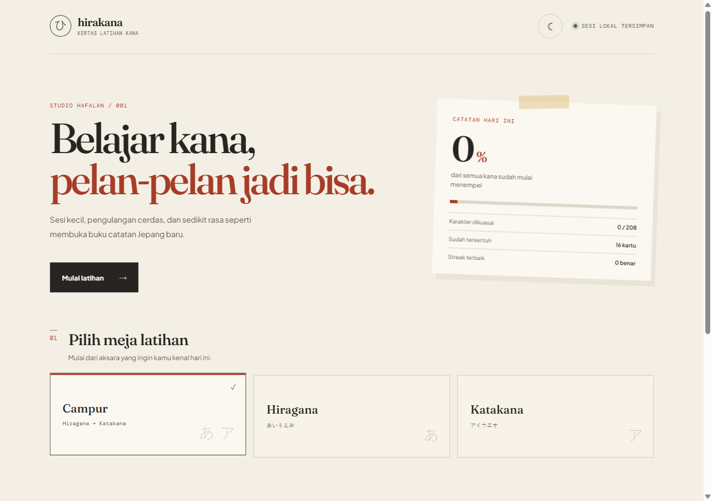
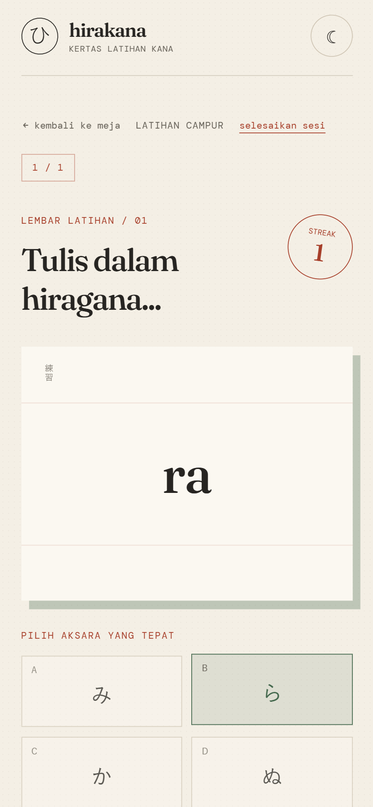

# Hirakana

Aplikasi web sederhana untuk melatih hiragana dan katakana dengan sesi tanpa batas, review kartu salah, streak, dan progres ingatan yang tersimpan di browser.

## Menjalankan lokal

```bash
npm install
npm run dev
```

## Build produksi

```bash
npm run build
npm run preview
```

## Fitur

- Mode campur, hiragana, dan katakana
- Soal romaji ke kana dan kana ke romaji
- Umpan balik langsung dan antrean kartu untuk diulang
- Progress, streak, tingkat ingatan, dan kartu review tersimpan di `localStorage`
- Tema terang/gelap yang mengikuti preferensi browser untuk pengguna baru
- Responsif untuk desktop dan mobile

## Pratinjau





## Teknologi

- React + Vite
- JavaScript ES modules
- CSS kustom tanpa UI framework
- `localStorage` untuk persistence lokal
